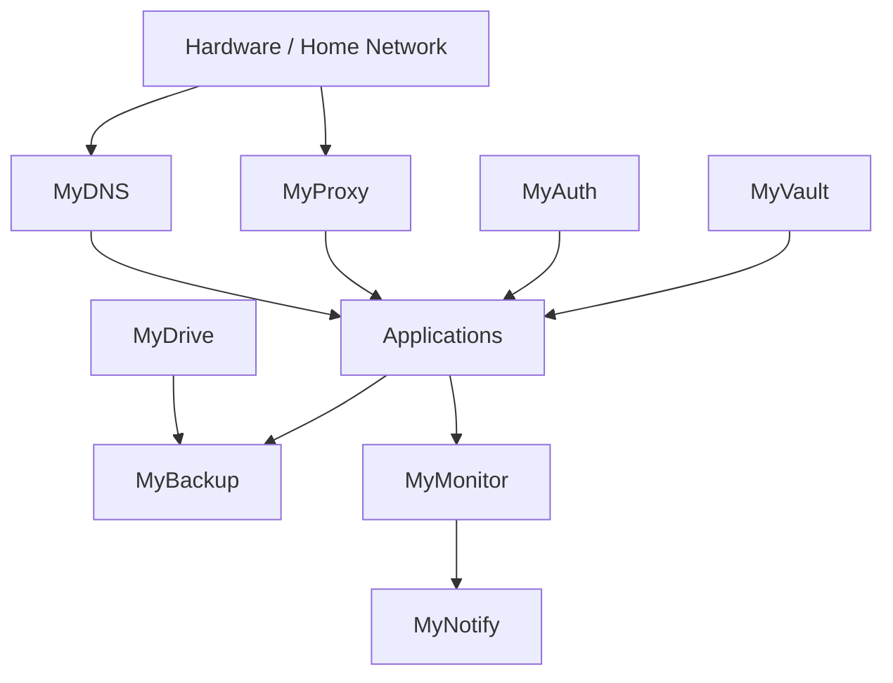

# Ecosystem Architecture

My Systems is designed as a set of independently deployable systems with optional integration between them.

## Principles

### Independent first
A system should provide useful functionality without requiring the entire My Systems stack.

### Integrate where it matters
Integration is justified when it improves usability, security, reliability or operational efficiency.

### Layer responsibilities

- **MyDNS** - naming and DNS resolution
- **MyProxy** - gateway and controlled exposure
- **MyAuth** - identity and authentication
- **MyVault** - secrets and credentials
- **MyDrive** - active storage
- **MyBackup** - recovery
- **MyMonitor** - observability
- **MyNotify** - notification delivery

## Deployment Model

The ecosystem can run on one machine or across several nodes. A repurposed laptop is a valid starting point; systems should not assume enterprise infrastructure.

The architecture should remain portable across:

- Linux servers
- Virtual machines
- Containers
- Repurposed desktops/laptops
- Small home servers

## Network Model

MyDNS may provide internal names, while MyProxy controls service ingress. External access should be deliberate rather than exposing every service directly.

## Data Model

Persistent user data should have explicit ownership, backup and recovery strategies. MyDrive and MyBackup are intentionally separate to avoid confusing primary storage with disaster recovery.
