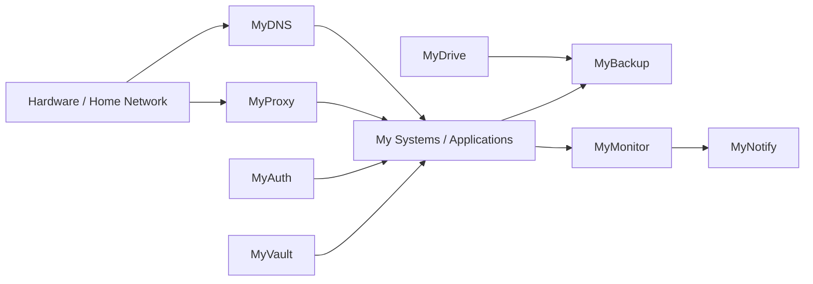

# My Systems

## Build your own systems.

My Systems is a family of self-hosted, configurable systems for people who want more control over their own infrastructure, services and data.

From a repurposed laptop running personal storage to a complete home infrastructure stack, each system is designed to be useful independently while remaining composable with the rest of the ecosystem.

## Ecosystem

### 🧭 MyDNS
**Own your DNS.**

A configurable DNS resolver/server for local DNS, custom zones, upstream resolution, caching and filtering.

**Status:** Building

### ☁️ MyDrive
**Own your storage.**

Personal cloud storage, synchronization, sharing and remote access running on hardware you control.

**Status:** Planned

### 🗄️ MyBackup
**Own your recovery.**

Central backup and snapshot infrastructure for machines and My Systems.

**Status:** Planned

### 🔐 MyVault
**Own your secrets.**

Password, credential, API-key and sensitive-secret management.

**Status:** Planned

### 🪪 MyAuth
**Own your identity.**

Central authentication and identity for self-hosted services.

**Status:** Planned

### 🌐 MyProxy
**Own your gateway.**

Reverse proxy, service routing, TLS and controlled external access.

**Status:** Planned

### 📊 MyMonitor
**Know what is running.**

Health checks, metrics, logs, alerts and operational visibility across the ecosystem.

**Status:** Planned

## Ideas

- 🏠 **MyHome** - personal infrastructure dashboard and automation.
- 🔔 **MyNotify** - central notification service.
- 📦 **MyRegistry** - self-hosted package/container/artifact registry.
- ✉️ **MyMail** - self-hosted email infrastructure.
- ⚙️ **MyCI** - self-hosted CI/CD infrastructure.

## Architecture

These relationships describe potential integration, not mandatory dependencies. Every system should remain independently deployable.

## Design

My Systems follows a shared technical identity:

- restrained, engineering-oriented visual language
- dark and light themes
- semantic colour tokens
- consistent `MyX` naming
- system-specific accent colours within one family
- accessible contrast and clear information hierarchy
- documentation-first operational thinking

See the [Brand Profile](brand/brand-profile.md).

## Documentation

- [Systems](systems/)
- [Ecosystem Architecture](architecture/ecosystem.md)
- [Brand Profile](brand/brand-profile.md)
