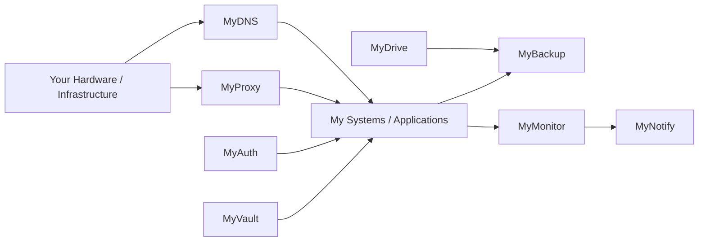

# My Systems

## Open systems. Self-hosted. Yours.

My Systems is a family of **open-source, self-hosted and self-managed systems** for people who want greater ownership, privacy and control over their infrastructure, services and data.

Each system is designed to provide a practical alternative to relying entirely on third-party hosted services. Run the software on hardware or infrastructure you control, configure it to suit your needs, and integrate it with the rest of your environment.

The goal is not to rebuild everything from scratch or reject the cloud. It is to give people the option to **own and operate the systems that matter to them**.

## Ecosystem

### 🧭 MyDNS
**Own your DNS.**

An open-source, self-hosted DNS resolver/server for local DNS, custom zones, upstream resolution, caching and filtering.

**Status:** Building

### ☁️ MyDrive
**Own your storage.**

Personal cloud storage, synchronization, sharing and remote access that you can self-host and manage on your own infrastructure.

**Status:** Planned

### 🗄️ MyBackup
**Own your recovery.**

Central backup and snapshot infrastructure for machines and My Systems, designed for self-managed storage and recovery.

**Status:** Planned

### 🔐 MyVault
**Own your secrets.**

Self-hosted management for passwords, credentials, API keys and other sensitive information.

**Status:** Planned

### 🪪 MyAuth
**Own your identity.**

Central identity and authentication for self-hosted services and applications.

**Status:** Planned

### 🌐 MyProxy
**Own your gateway.**

Reverse proxy, service routing, TLS and controlled external access for your own services.

**Status:** Planned

### 📊 MyMonitor
**Know what is running.**

Health checks, metrics, logs, alerts and operational visibility across self-managed infrastructure.

**Status:** Planned

## Ideas

- 🏠 **MyHome** - personal infrastructure dashboard and automation.
- 🔔 **MyNotify** - central notification service.
- 📦 **MyRegistry** - self-hosted package/container/artifact registry.
- ✉️ **MyMail** - self-hosted email infrastructure.
- ⚙️ **MyCI** - self-hosted CI/CD infrastructure.

## Architecture

These relationships describe potential integration, not mandatory dependencies. Every system should remain independently deployable and self-manageable.

## Principles

### Ownership
Your infrastructure should remain understandable and controllable by you.

### Privacy
Keep sensitive data and services under your control where doing so provides meaningful value.

### Open source
The systems are intended to be open, inspectable and modifiable.

### Independence
Each system should be useful on its own rather than requiring the entire ecosystem.

### Composability
Systems should integrate through clear interfaces and established standards.

### Practicality
Self-hosting should be an option, not an ideology. Use hosted services when they make sense; use your own systems when ownership, privacy or control matter more.

## Design

My Systems follows a shared technical identity:

- restrained, engineering-oriented visual language
- dark and light themes
- semantic colour tokens
- consistent `MyX` naming
- system-specific accent colours within one family
- accessible contrast and clear information hierarchy
- documentation-first operational thinking

See the [Brand Profile](brand/brand-profile.md).

## Documentation

- [Systems](systems/)
- [Ecosystem Architecture](architecture/ecosystem.md)
- [Brand Profile](brand/brand-profile.md)
